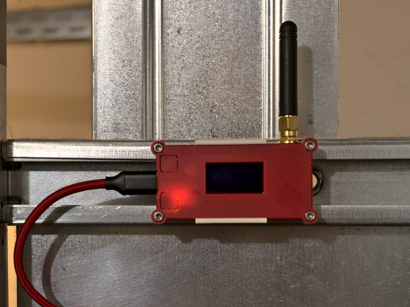

# LoRa-Connect

This project connects your _Home Connect_ device to your home automation via MQTT using LoRa.

> **WARNING**: This project is not for the faint-hearted. You **will** need developer skills and at least one hour of your time only to get the configuration straight. You also need to know how to use the Arduino IDE to program the microcontrollers. I cannot help you if this project would solve your problem, but your knowledge is not sufficient to set it up.

> **WORK IN PROGRESS!** This project is working, but still in a prototype phase.

## Why?

I recently bought a clothes washer that is [Home Connect](https://www.home-connect.com) enabled. Unfortunately, the machine is in a shared laundry room in the basement, and out of reach of my WLAN. I tried to use PLC, but it killed my DSL, so I am unable to connect the machine to the Home Connect cloud.

Thanks to Trammell Hudson blog article about ["hacking your dishwasher"](https://trmm.net/homeconnect/), I learned that it is possible to directly connect to the machine, without having to use the Home Connect cloud.

This project consists of two ESP32 microcontrollers. One is located in the basement. It connects to the washer, and transmits the current status to my flat using LoRa. The other microcontroller is located in my flat. It receives the status messages from LoRa, converts them into JSON messages, and sends them to MQTT for further processing in my home automation.

Unfortunately (for you), I have no plans to buy more Home Connect appliances in the foreseeable future, so the project will be more or less limited to my washing machine. Also I am only interested in the current status, mainly the remaining time, so it is not possible to remote control the machine.

However I hope that this project is a good starting point for your own experiments and extensions. Please feel free to fork and extend this project, to support more machine types (like dishwashers), or maybe even remote control the machines via MQTT.

See also my [To-Do list](TODO.md).

## DISCLAIMER

* The project bases on reverse engineering. There is no guarantee that it will work with your Home Connect appliance. It might also stop working some day, e.g. after a protocol change of the manufacturer.
* LoRa uses certain radio frequencies for transmission. The permitted frequencies, maximum transmission power, package sizes, duty cycles, and other parameters differ from country to country. It is **YOUR responsibility** to properly configure the project, and to make sure it complies to the rules of **YOUR** country. Failure to do so may result in legal problems, claims for damages, and even imprisonment. The author of this project cannot be held liable.
* C isn't the language that I am most proficient with. The source code is ugly, badly formatted, probably has memory leaks, and certainly has a lot of things that a good C developer would do much better. I am open for your constructive feedback. But on the other hand, it is working for me, so I'm fine with it. 😉

# Hardware

* 2x Heltec Automation WiFi LoRa 32(V2) modules (one sender, one receiver). This project uses proprietary Heltec libraries, and is unlikely to run on other LoRa microcontrollers.
* A 3D printed case for the module is available at [Printables](https://www.printables.com/model/425740-heltec-lora32-minimal-case).

# Firmware

* The sender firmware can be found in the `sender` directory.
* The receiver firmware can be found in the `receiver` directory.

Both projects need configuration files. To create them, copy the respective `config.h.example` file to `config.h`, and then manually change it to your needs.

You will need to run [hcpy hcauth](https://github.com/osresearch/hcpy) first to create a `config.json` file.

## Dependencies

You need to install these dependencies in your Arduino library (with the tested version in brackets):

* [ArduinoJson](https://arduinojson.org/) by Benoit Blanchon (6.21.0)
* [Base64](https://github.com/Densaugeo/base64_arduino) by Densaugeo (1.3.0)
* [Crypto](https://rweather.github.io/arduinolibs/crypto.html) by Rhys Weatherley (0.4.0)
* [Heltec ESP32 Dev-Boards](https://github.com/HelTecAutomation/Heltec_ESP32) by Heltec Automation (1.1.1)
* [PubSubClient](https://github.com/knolleary/pubsubclient) by Nick O'Leary (2.8.0)
* [Web Sockets](https://github.com/Links2004/arduinoWebSockets) by Markus Sattler (2.3.6)

# Configuration

Configuring this project is not easy, and will take a considerable amount of time, investigation, and patience. However it is likely to be the most difficult part of the setup.

* First, register your appliance with Home Connect. If there is no WLAN present, you can also register it using a smartphone and the Home Connect app. The appliance will then spawn an access point for registration.
* After that, you need to create your `config.json` file. This can be done with [hcpy](https://github.com/osresearch/hcpy).
* In the `sender` and `receiver` directory, you will find `config.h.example` files. Make a copy of each, named `config.h`.
* Now run the `config-converter.py` tool. It will extract the `key` and `iv` values that are required for the next step, and will also generate a `mapping.cpp` file that is needed by the receiver. Invocation is: `./config-converter.py /your/path/to/hcpy/config.json > receiver/mapping.cpp`
* The previous step also extracts the `key` and `iv` values from the `config.json` file. You can copy the output into your `sender/config.h` file. If the `config-converter.py` complains that there is no `iv` value, I'm afraid you have bad luck. This project only supports websockets via port 80, with a special kind of encryption. If there is no `iv` value, it means that your appliance uses the wss protocol via port 443, with standard SSL. Also, this project currently only supports a single appliance. (See [TODO](TODO.md))
* The `LORA` defines in the `config.h` are depending on your country. To find the correct values, contact the dealer of your LoRa board or read the Heltec manual. Do not just use values that you have found somewhere on the internet. The `LORA` configuration of the sender and receiver must be identical.
* The other configuration values depend on your WLAN and MQTT setup. Note that you are actually working with two different WLAN settings. On the _sender_ side, you set up a WLAN AP that your appliance will connect to. On the _receiver_ side, you set the parameters of your existing home WLAN. Both WLANs must have different SSIDs and passwords. (If your appliance is connected to your home WLAN, you actually won't need this solution, but you can just use [hcpy](https://github.com/osresearch/hcpy).)
* Check your `config.h` files again. If they are good, the configuration is finally completed. You can now build and install the sender and receiver firmwares.

# Open Source

This project is open source!

## Kudos

* This project would not exist without Trammell Hudson's awesome blog article about ["hacking your dishwasher"](https://trmm.net/homeconnect/) and the related [hcpy](https://github.com/osresearch/hcpy) project. Thank you, Trammell!
* The [CBC implementation](sender/CBC.cpp) was copied from the [arduinolibs](https://github.com/rweather/arduinolibs) crypto legacy by Rhys Weatherley. Note that the license of this project does not apply to the `CBC.cpp` and `CBC.h` files!

## Contribution

* Fork the [Source code at GitHub](https://github.com/shred/lora-connect). Feel free to send pull requests.
* Found a bug? [File a bug report!](https://github.com/shred/lora-connect/issues)

## License

_LoRa-Connect_ is open source software. The source code is distributed under the terms of [GNU General Public License (GPLv3+)](LICENSE.txt).
